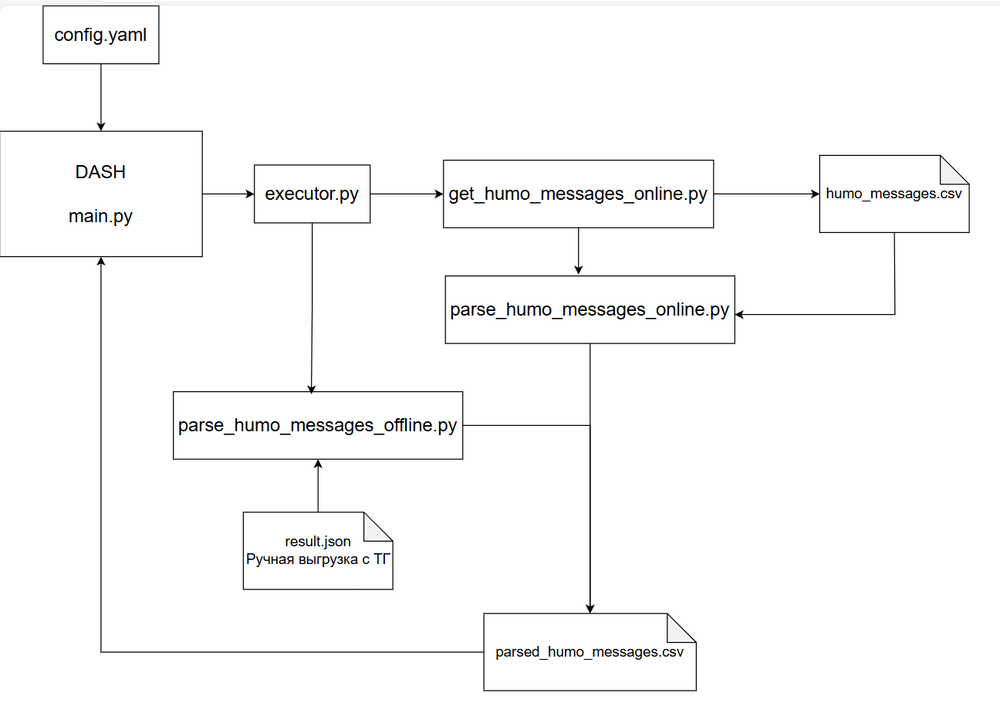
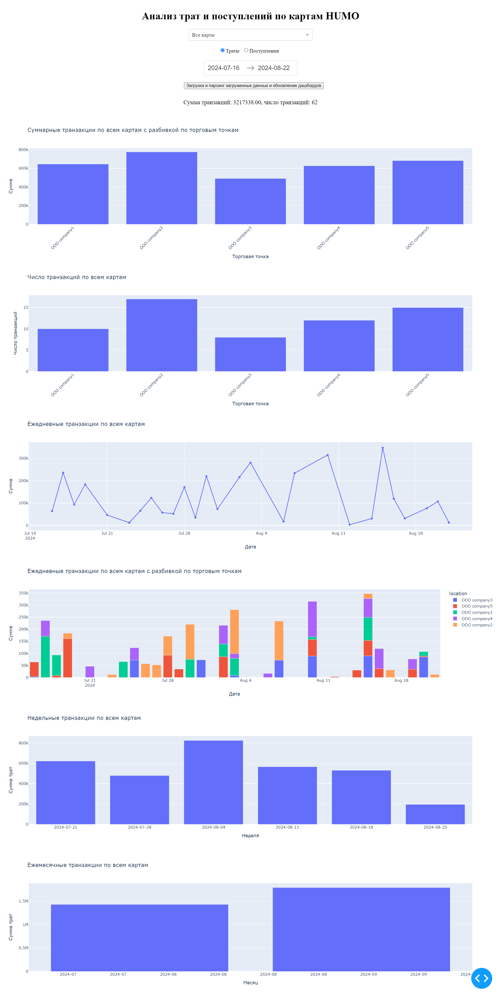

# Приложение для анализа трат и поступлений по картам HUMO

> **Дисклеймер:** Данное приложение не связано с HUMO или банками Узбекистана. Проект является некоммерческим инструментом для анализа данных

Приложение создано с использованием Dash (веб-фреймворка, построенного на Flask). Оно помогает визуализировать траты и поступления по картам. Возможности:

- Визуализация транзакций с разбивкой по торговым точкам.
- Отображение графиков ежедневных транзакций.
- Анализ транзакций по неделям и месяцам.

Доступны следующие фильтры:
1. Фильтрация по карте.
2. Фильтрация по типу транзакций (траты и поступления).
3. Фильтрация по диапазону дат.
4. Интерактивная загрузка данных с Telegram-бота или загрузка ручной выгрузки истории чата (на выбор).

**Важно!** Для использования приложения нужен подключенный к картам официальный Telegram-бот хумо (@HUMOcardbot). Ссылку на бот так же можно найти через официальный сайт humo (https://humocard.uz/ru/press_center/news/telegram-soobshcheniya-vmesto-sms-/)

--- 

## Installation

1. Клонировать репу и установить зависимости

   ```bash
   git clone https://github.com/emilcube/card-expense-analyzer.git
   cd card-expense-analyzer
   pip install -r requirements.txt
   ```
2. Приложение разворачивается локально, есть два варианта работы программы **на выбор**:
   - Режим автоматической выгрузки сообщений с Telegram-бота с помощью Telethon
   - Оффлайн режим - ручная выгрузка сообщений с бота

3. Все конфигурации задаются в конфигурационном файле программы config.yaml

   - Вариант работы программы устанавливается флагом `is_online_mode_getting_tg_messages` (в `config.yaml`):
     - `false` — оффлайн режим.
     - `true` — автоматический режим загрузки сообщений.

4. 
   Для работы в оффлайн режиме необходимо:
    - Выгрузить сообщения с бота в файл в формате `.json` (экспорт чата через desktop версию Telegram клиента).
    - Задать путь к этому файлу в переменной `messages_file_filepath` в `config.yaml`. Путь задавать относительный (к примеру `data/result.json`).
 
   Для работы в режиме автоматической выгрузки сообщений:
    - Получить API ключи на [my.telegram.org](https://my.telegram.org/), получите `api_id` и `api_hash` и укажите их в `config.yaml`. Можно загуглить более детальную инструкцию получения API ключей, там нужно авторизоваться, перейти в раздел API, создать новое приложение и только тогда получить API ключи.
    - Запустить `get_humo_messages_online.py`. Нужно будет залогиниться (ввести номер телефона). После авторизации будет создан файл `session_name.session`, который обеспечит автоматическую авторизацию в будущем.

5. Всё готово к запуску. Можно запускать main.py, открыть url в браузере и пользоваться.

**Резюмируя.**
Нужно выбрать режим запуска, задав переменную is_online_mode_getting_tg_messages. Для онлайн режима (автоматический режим сбора сообщений) задать api_id, api_hash и один раз запустить `get_humo_messages_online.py`. А если выберите оффлайн режим, то нужно только задать путь к файлу выгрузки messages_file_filepath, и всё.

## Запуск в Docker
```bash
docker build -t card_expense_analyzer .
docker run -d -p 8050:8050 -v ${PWD}/config.yaml:/app/config.yaml -v ${PWD}/data:/app/data -v ${PWD}/session_name.session:/app/session_name.session --name card_expense_analyzer_container card_expense_analyzer:latest
```

## Архитектура приложения



## Пример запуска приложения

